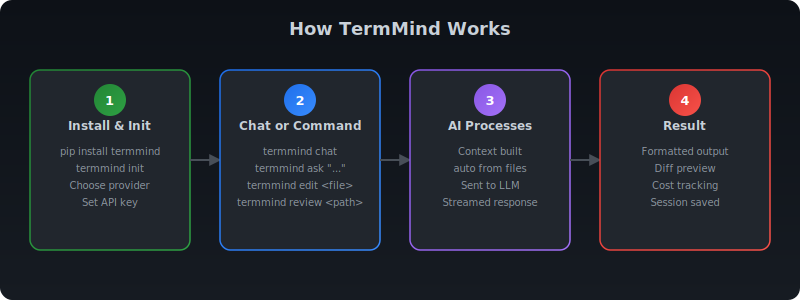
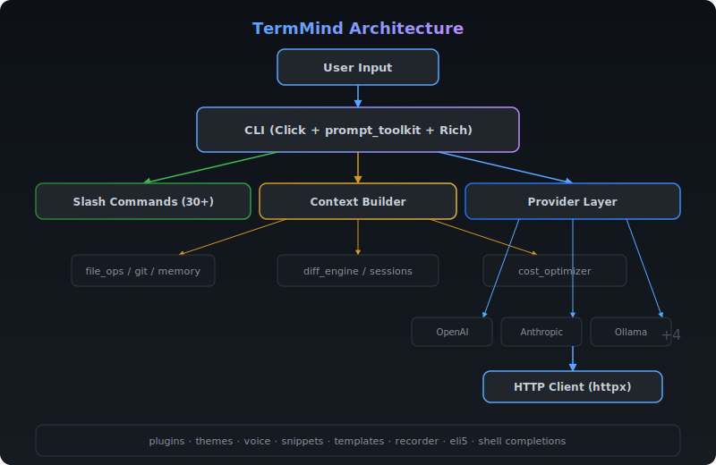

<!-- TermMind: AI terminal assistant supporting 9+ LLM providers. Chat with GPT, Claude, Gemini, Mistral, Cohere in your terminal with security scanning, code generation, and 50+ commands. -->
<!-- Keywords: AI terminal assistant, CLI coding tool, GPT terminal, Claude terminal, coding assistant, AI code editor, terminal AI chat, LLM CLI tool, security scanner, code generation, Mistral AI, Cohere -->

<p align="center">
  <a href="https://github.com/rudra496/termmind/actions/workflows/ci.yml">
    
  </a>
  
  <a href="https://pypi.org/project/termmind/">
    
  </a>
  
  
  
  <a href="https://github.com/rudra496/termmind/stargazers">
    
  </a>
  <a href="https://github.com/rudra496/termmind/issues">
    
  </a>
  <a href="https://github.com/rudra496/termmind/commits">
    
  </a>
  <a href="https://github.com/rudra496/termmind">
    
  </a>
  <a href="https://pypi.org/project/termmind/">
    
  </a>
</p>

<h1 align="center">⚡ TermMind</h1>

<p align="center">
  <strong>AI-Powered Terminal Assistant</strong><br>
  Chat with GPT, Claude, Gemini, Mistral, and more — directly in your terminal.
</p>

<p align="center">
  
</p>

<p align="center">
  <a href="#-quick-start">Quick Start</a> •
  <a href="#-features">Features</a> •
  <a href="#-providers">Providers</a> •
  <a href="#-commands">Commands</a> •
  <a href="#-architecture">Architecture</a> •
  <a href="#-configuration">Configuration</a> •
  <a href="#-contributing">Contributing</a> •
  <a href="#-documentation">Documentation</a> •
  <a href="#-license">License</a>
</p>

---

## 🖥️ Demo

<p align="center">
  
</p>

```
$ termmind chat

  ╔═══════════════════════════════════╗
  ║      T e r m M i n d            ║
  ║   AI Terminal Assistant v2.0.0  ║
  ╚═══════════════════════════════════╝

Provider: ollama | Model: llama3.2 | Git: detected ✓

❯ Refactor this function to use a list comprehension

🤖 Thinking...
┌──────────────────────────────────────────────┐
│ Here's the refactored version using a list   │
│ comprehension:                               │
│                                              │
│   def get_urls(text):                        │
│       return [m.group(1) for line in text    │
│               for m in re.finditer(...)]     │
│                                              │
│ This is ~40% shorter and avoids the nested   │
│ append pattern.                              │
└──────────────────────────────────────────────┘

⚡ 1,247 tokens • 2.3s • $0.000000
```

## 🚀 Quick Start

```bash
# Install
pip install termmind

# Or from source
git clone https://github.com/rudra496/termmind.git
cd termmind
pip install -e .

# Setup (first run)
termmind init

# Start chatting
termmind chat

# One-shot question
termmind ask "How do I reverse a list in Python?"

# Edit a file with AI
termmind edit main.py "Add type hints to all functions"

# Review code
termmind review src/

# Generate tests
termmind test utils.py --framework pytest

# Security scan (NEW)
termmind scan src/
termmind scan api.py --ai    # AI-powered deep review

# Generate code from description (NEW)
termmind generate api "REST API for blog with auth" -f fastapi
termmind generate test "user auth module" -o test_auth.py

# Pipe support (NEW)
cat error.log | termmind pipe
git diff | termmind ask "Summarize these changes"

# Prompt library (NEW)
termmind prompts list
termmind prompts use code-review
```

### Docker

```bash
docker build -t termmind .
docker run -it --rm -v $(pwd):/workspace termmind chat
```

## ✨ Features

- **9 LLM Providers** — OpenAI, Anthropic (Claude), Gemini, Mistral, Cohere, Groq, Together, OpenRouter, Ollama
- **Security Scanner** — 15+ vulnerability detection rules + AI-powered deep review
- **AI Code Generation** — Generate APIs, classes, tests, Dockerfiles from natural language
- **Prompt Library** — 12+ built-in templates for code review, debugging, optimization, and more
- **Smart Autocomplete** — Context-aware file, command, and action suggestions
- **Streaming Responses** — Real-time markdown rendering with syntax highlighting
- **Smart Code Context** — Automatically includes relevant files based on your query
- **File Editing** — AI-powered edits with diff preview and undo
- **Code Review** — Get constructive feedback on any file or directory
- **Test Generation** — Generate pytest/unittest tests for any file
- **Refactoring Engine** — 8 AI-powered operations (extract function, rename, simplify, etc.)
- **Git Integration** — Status, diff, commit with AI-generated messages, branch management
- **Code Index** — Parse 10+ languages, query functions/classes, persist across sessions
- **Session Management** — Save, load, export conversations
- **Snippet Manager** — Save, search, import/export reusable code blocks
- **Project Templates** — Scaffold from 8 templates (FastAPI, Flask, Next.js, Django, etc.)
- **Voice Mode** — Text-to-speech for AI responses (optional)
- **Cost Tracking** — Token usage, cost estimation, budget alerts, provider comparison
- **Plugin System** — Extend with custom plugins (TodoTracker, CodeStats, AutoCommit built-in)
- **Pipe Support** — Process piped stdin with AI
- **5 Color Themes** — Dark, Light, Solarized, Dracula, Monokai
- **Shell Completions** — Bash, Zsh, Fish
- **Session Recording** — Record, replay, and export sessions as HTML
- **ELI5 Mode** — Simplified explanations for any topic
- **Multi-line Input** — Shift+Enter for newlines

## 🌐 Providers

| Provider | Free Tier | Local | Default Model |
|----------|-----------|-------|---------------|
| **Ollama** | ✅ Free | ✅ Yes | llama3.2 |
| **Groq** | ✅ Free | ❌ | llama-3.3-70b |
| **Gemini** | ✅ Free | ❌ | gemini-2.0-flash |
| **OpenAI** | 💰 Paid | ❌ | gpt-4o-mini |
| **Anthropic** | 💰 Paid | ❌ | claude-sonnet-4 |
| **Mistral** | 💰 Paid | ❌ | mistral-small |
| **Cohere** | 💰 Paid | ❌ | command-r-plus |
| **Together** | 💰 Paid | ❌ | llama-3-70b |
| **OpenRouter** | 💰 Varies | ❌ | gpt-4o-mini |

Switch providers mid-conversation: `/provider ollama`

## ⌨️ Commands

### File Operations
| Command | Description |
|---------|-------------|
| `/edit <file> [instruction]` | Edit a file with AI |
| `/run <cmd>` | Run a shell command |
| `/files` | List files in context |
| `/search <query>` | Search in project files |
| `/grep <pattern>` | Grep with regex |
| `/tree [--depth N]` | Show file tree |
| `/undo [--all]` | Undo last/all edits |
| `/diff [file]` | Show session changes |

### Chat & Session
| Command | Description |
|---------|-------------|
| `/clear` | Clear conversation |
| `/save [name]` | Save session |
| `/load [name]` | Load session |
| `/sessions` | List saved sessions |
| `/export [--json]` | Export conversation |
| `/compact` | Compact to save tokens |

### Provider & Model
| Command | Description |
|---------|-------------|
| `/model [name]` | Switch model |
| `/providers` | List all providers |
| `/cost` | Show usage & cost |
| `/cost compare` | Compare provider costs |
| `/cost optimize` | Suggest savings |

### Git
| Command | Description |
|---------|-------------|
| `/git status` | Git status |
| `/git diff` | Git diff |
| `/git log` | Recent commits |
| `/git commit` | AI-generated commit message |
| `/git checkout <branch>` | Switch branch |

### Advanced
| Command | Description |
|---------|-------------|
| `/refactor <op> <file>` | AI-powered refactoring |
| `/snippet save <name>` | Save a code snippet |
| `/template use <name>` | Scaffold a project |
| `/index` | Build code index |
| `/symbols [pattern]` | List functions/classes |
| `/record start` | Start session recording |
| `/voice on` | Enable text-to-speech |
| `/eli5 <topic>` | Explain Like I'm 5 |

### CLI Commands
```bash
termmind chat          # Interactive chat session
termmind ask "..."     # One-shot question
termmind edit <file>   # Edit a file
termmind review <path> # Review code
termmind test <file>   # Generate tests
termmind explain <f>   # Explain a file
termmind debug <file>  # Debug a file
termmind refactor <f>  # Refactor a file
termmind docstring <f> # Add docstrings
termmind translate <f> # Translate comments
termmind scan <path>   # Security vulnerability scan (NEW)
termmind generate <t>  # AI code generation (NEW)
termmind pipe          # Process piped stdin (NEW)
termmind prompts list  # Prompt library (NEW)
termmind init          # Setup wizard
termmind config        # Show config
termmind index         # Build code index
termmind symbols       # List symbols
termmind doctors       # Health check
termmind completions   # Shell completions
```

## 🏗 Architecture

<p align="center">
  
</p>

## 🔧 Configuration

Config stored at `~/.termmind/config.json`:

```json
{
  "provider": "ollama",
  "api_key": "",
  "model": "llama3.2",
  "max_tokens": 4096,
  "temperature": 0.7,
  "theme": "dark",
  "auto_context": true,
  "max_context_files": 20,
  "confirm_edits": true,
  "stream": true
}
```

## 🤝 Contributing

Contributions are welcome! Please see [CONTRIBUTING.md](CONTRIBUTING.md) for guidelines.

1. Fork the repository
2. Create your feature branch (`git checkout -b feature/amazing`)
3. Commit your changes (`git commit -m 'Add amazing feature'`)
4. Push to the branch (`git push origin feature/amazing`)
5. Open a Pull Request

## 📚 Documentation

- [Architecture](docs/ARCHITECTURE.md) — Module design and data flow
- [FAQ](docs/FAQ.md) — Frequently asked questions
- [Changelog](CHANGELOG.md) — Version history
- [Roadmap](ROADMAP.md) — Planned features
- [Support](SUPPORT.md) — Getting help
- [Examples](examples/README.md) — Usage examples

## 📄 License

MIT License — see [LICENSE](LICENSE) for details.

## ⭐ Star History

<a href="https://star-history.com/#rudra496/termmind&Date">
 <picture>
   <source media="(prefers-color-scheme: dark)" srcset="https://api.star-history.com/svg?repos=rudra496/termmind&type=Date&theme=dark" />
   <source media="(prefers-color-scheme: light)" srcset="https://api.star-history.com/svg?repos=rudra496/termmind&type=Date" />
   
 </picture>
</a>

---

## 🔗 Connect

- [](https://github.com/rudra496)
- [](https://www.linkedin.com/in/rudrasarker)
- [](https://x.com/Rudra496)
- [](https://youtube.com/@rudrasarker9732)
- [](https://dev.to/rudra_sarker)

---

<p align="center">
  Built with ❤️ by <a href="https://github.com/rudra496">Rudra Sarker</a>
</p>
